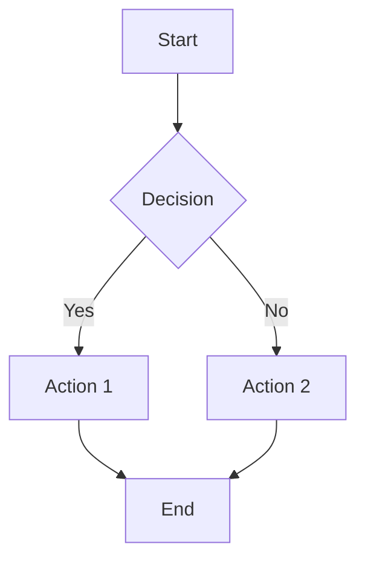

# 📝 Professional Markdown Editor

A lightweight, single-file Markdown editor with live preview, Mermaid diagrams, and KaTeX formula support.

  

---

## ✨ Features

- **Live Preview** — See rendered output as you type
- **Mermaid Diagrams** — Flowcharts, sequence diagrams, and more
- **KaTeX Formulas** — Inline `$...$` and block `$$...$$` LaTeX support
- **Syntax Highlighting** — JavaScript, Python, CSS code blocks
- **Dark / Light Mode** — Toggle with one click
- **Auto-save** — Content saved to localStorage automatically
- **Export** — Download as `.md` or `.html`
- **Keyboard Shortcuts** — Ctrl+B, Ctrl+I, Ctrl+K, Ctrl+S
- **Responsive** — Works on desktop and mobile
- **Zero dependencies** — Single `index.html` file, no install needed

---

## 🚀 Quick Start

1. Clone or download the repo
2. Open `index.html` in any modern browser
3. Start writing Markdown

```bash
git clone https://github.com/uwamuwa00/markdown-editor.git
cd markdown-editor
# Open index.html in your browser
```

No Node.js, no npm, no build step required.

---

## ⌨️ Keyboard Shortcuts

| Shortcut | Action |
|----------|--------|
| `Ctrl+B` | Bold |
| `Ctrl+I` | Italic |
| `Ctrl+K` | Insert Link |
| `Ctrl+H` | Heading |
| `Ctrl+S` | Save |
| `Tab` | Indent |

---

## 🧩 Mermaid Example

````markdown

````

---

## 🔢 KaTeX Example

```markdown
Inline: $E = mc^2$

Block:
$$\int_{-\infty}^{\infty} e^{-x^2} dx = \sqrt{\pi}$$
```

---

## 🛠️ Built With

- [Mermaid.js](https://mermaid.js.org/) — Diagram rendering
- [KaTeX](https://katex.org/) — Math formula rendering
- Vanilla HTML / CSS / JavaScript

---

## 📄 License

MIT — free to use, modify, and distribute.
