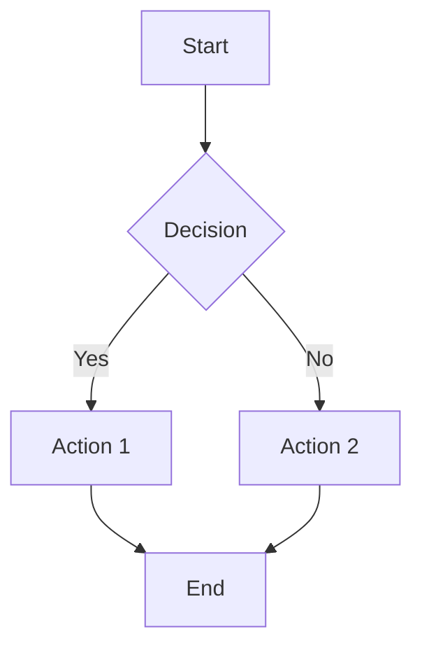

# 📝 Professional Markdown Editor

A lightweight, single-file Markdown editor with live preview, Mermaid diagrams, and KaTeX formula support.

  

---

## ✨ Features

- **Live Preview** — See rendered output as you type
- **Formula Picker** — Visual popup with 90+ categorized LaTeX formulas (Ctrl+M)
- **Mermaid Diagrams** — Flowcharts, sequence diagrams, and more
- **KaTeX Formulas** — Inline `$...$` and block `$$...$$` LaTeX support
- **Syntax Highlighting** — JavaScript, Python, CSS code blocks
- **Dark / Light Mode** — Toggle with one click, full KaTeX dark mode support
- **Spellcheck Toggle** — On/off switch via `ABC` button, off by default (better for code & LaTeX)
- **Split Panel UI** — Divider line between editor and preview, distinct background tones for each panel
- **Auto-save** — Content saved to localStorage automatically
- **Export** — Download as `.md` or `.html`
- **Keyboard Shortcuts** — Ctrl+B, Ctrl+I, Ctrl+K, Ctrl+S, Ctrl+M
- **Responsive** — Works on desktop and mobile
- **Zero dependencies** — Single `index.html` file, no install needed

---

## 🚀 Quick Start

1. Clone or download the repo
2. Open `index.html` in any modern browser
3. Start writing Markdown

```bash
git clone https://github.com/uwamuwa00/markdown-editor.git
cd markdown-editor
# Open index.html in your browser
```

No Node.js, no npm, no build step required.

---

## ⌨️ Keyboard Shortcuts

| Shortcut | Action |
|----------|--------|
| `Ctrl+B` | Bold |
| `Ctrl+I` | Italic |
| `Ctrl+K` | Insert Link |
| `Ctrl+H` | Heading |
| `Ctrl+S` | Save |
| `Ctrl+M` | Open Formula Picker |
| `Tab` | Indent |
| `ESC` | Close any modal |
| `ABC` button | Toggle spellcheck on/off |

---

## 🔢 Formula Picker

Press **Ctrl+M** or click **Σ Formula** in the toolbar to open the formula picker.

### Categories

| Category | Examples |
|----------|---------|
| **Basic** | Fraction, square root, power, logarithm, infinity |
| **Trigonometry** | sin, cos, tan, cot, sec, csc, arcsin, sinh, Pythagorean identity |
| **Integral & Derivative** | Definite/indefinite integrals, partial derivatives, gradient, Laplacian |
| **Sum & Limit** | Summation, product, limits, Taylor series, geometric series |
| **Matrix & Vector** | 2×2/3×3 matrices, determinant, dot/cross product, eigenvalue |
| **Statistics** | Mean, std. deviation, normal distribution, binomial, expected value |
| **Logic & Sets** | ∀ ∃ ∈ ⊆ ∪ ∩ implication, biconditional, negation |
| **Complex Numbers** | Euler's formula and identity, modulus, argument, conjugate |

### How it works

1. Open the picker with **Ctrl+M** or the toolbar button
2. Select a category tab
3. Click a formula card — it appears in the live preview
4. Edit the LaTeX code directly if needed
5. Choose **Inline** (`$...$`) or **Block** (`$$...$$`) mode
6. Click **Insert** — the formula is placed at the cursor position

---

## 🧩 Mermaid Example

````markdown

````

---

## 🔢 KaTeX Example

```markdown
Inline: $E = mc^2$

Block:
$$\int_{-\infty}^{\infty} e^{-x^2} dx = \sqrt{\pi}$$
```

---

## 🛠️ Built With

- [Mermaid.js v11](https://mermaid.js.org/) — Diagram rendering
- [KaTeX 0.16.9](https://katex.org/) — Math formula rendering
- Vanilla HTML / CSS / JavaScript

---

## 🌟 Advanced Features

### Formula Picker (V2)
- 90+ formulas across 8 categories
- Live KaTeX preview before inserting
- Editable LaTeX input field
- Inline (`$...$`) and block (`$$...$$`) mode toggle
- Full dark mode support — all KaTeX symbols visible in both themes
- Keyboard accessible: Ctrl+M to open, ESC to close

### Spellcheck Toggle (V2)
- Off by default — avoids noise on LaTeX and code syntax
- `ABC` toolbar button toggles on/off with visual strikethrough indicator
- Enable when writing prose or long-form English content

### Split Panel Design (V2)
- 1px vertical divider line separates editor and preview
- Editor panel has a slightly darker background tone
- Preview panel has a slightly lighter background tone
- Distinction works in both dark and light themes — helps orient at a glance

### Turkish Character Support
- Full Turkish character support in Mermaid diagrams
- Automatic sanitization: `ş→s`, `ğ→g`, `ı→i`, `ç→c`, `ö→o`, `ü→u`
- Works in node labels, participants, and sequence diagrams

### Nested Blockquotes
```markdown
> Level 1 quote
>> Level 2 nested quote
>>> Level 3 deeply nested quote
```

### Enhanced List Parsing
- Proper unordered list (`-`, `*`, `+`) support
- Ordered list (`1.`, `2.`, etc.) support
- Indented lists with tabs/spaces
- No conflicts between list types

### Smart Mermaid Rendering
- Map-based storage preserves newlines
- No HTML encoding issues
- Fast rendering with Mermaid v11
- Error handling with descriptive messages

---

## 🔧 Technical Details

### Architecture
- **Single-file design**: Everything in `index.html`
- **Map-based Mermaid storage**: Prevents newline loss
- **Placeholder-based LaTeX parsing**: LaTeX extracted before markdown rules run — prevents `_italic_` rule from breaking subscripts like `x_i`
- **DOM API parsing**: Preserves whitespace
- **Debounced rendering**: Optimized performance
- **Modal system**: Unified overlay pattern for Table Builder and Formula Picker

### Browser Compatibility
- Chrome 90+
- Firefox 88+
- Safari 14+
- Edge 90+

### Performance Features
- Debounced input handling (100ms)
- Auto-save every 30 seconds
- Lazy Mermaid rendering
- Efficient syntax highlighting

---

## 📋 Changelog

### V2.0.0
- ✅ Formula Picker popup with 90+ formulas across 8 categories
- ✅ Live KaTeX preview inside the picker
- ✅ Inline / Block mode toggle
- ✅ Ctrl+M keyboard shortcut
- ✅ Full dark mode KaTeX rendering fix (SVG paths, fraction lines, all symbols)
- ✅ KaTeX parse order fix — formulas with subscripts (`x_i`) now render correctly
- ✅ Spellcheck toggle — off by default, `ABC` button to enable
- ✅ Panel divider — 1px vertical line between editor and preview
- ✅ Panel tone differentiation — editor and preview have distinct background tones

### V1.0.0
- ✅ Single file editor with live preview
- ✅ Dark / Light mode
- ✅ localStorage auto-save
- ✅ Export MD + HTML
- ✅ KaTeX formula support
- ✅ Mermaid graph + sequence diagrams
- ✅ Table builder modal
- ✅ Bullet + numbered lists

---

## 📄 License

MIT — free to use, modify, and distribute.

---

## 🤝 Contributing

Feel free to submit issues and enhancement requests!

---

**Made with ❤️ for the Markdown community**
